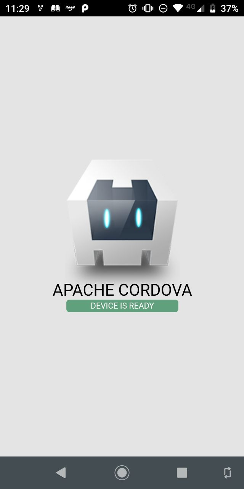
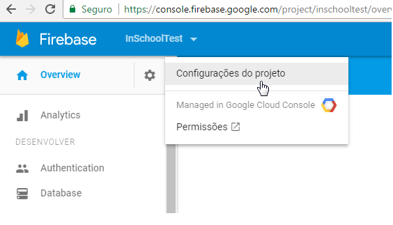
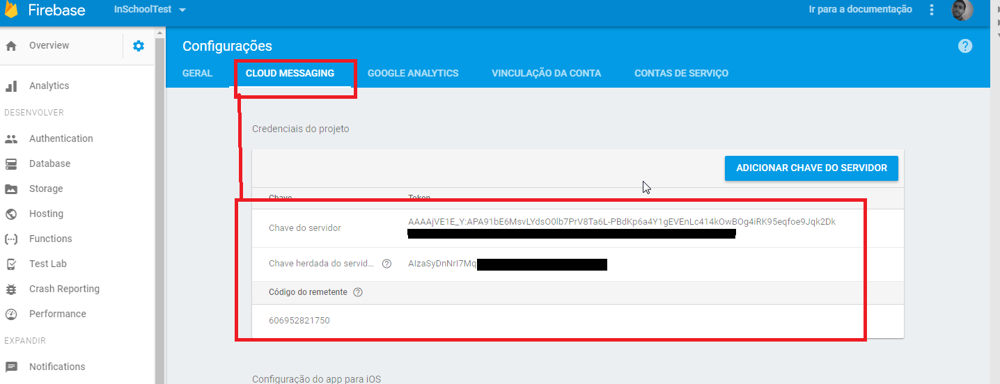
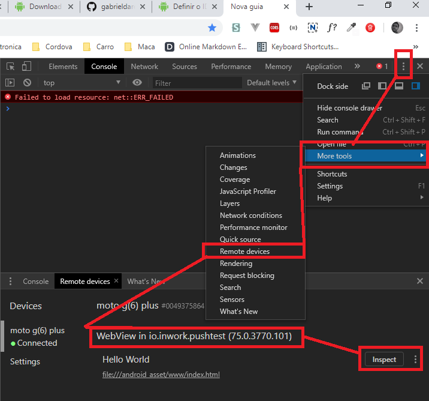
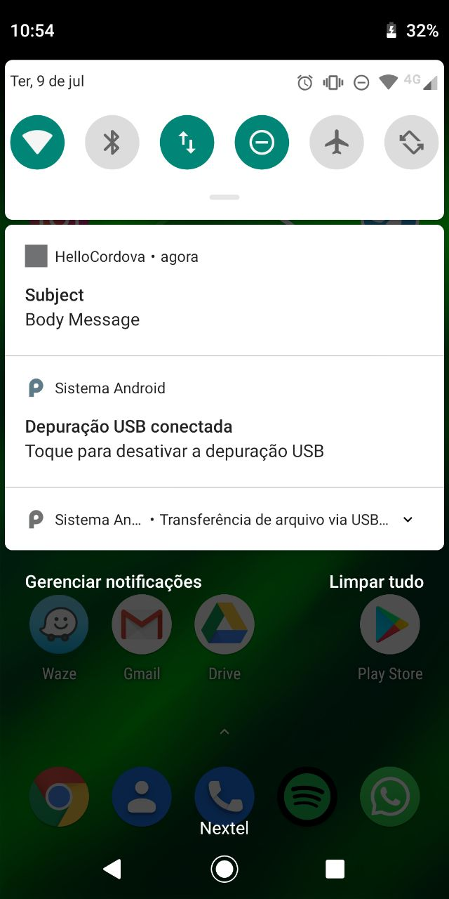

# Cordova PushNotification with php  

## Android 

Minha dica seria rodar o [Android Studio](https://developer.android.com/studio),configurar esse carinha da melhor maneira possivel compilar um 'Olá Mundo' no seu celular com Android Puro. 


## Cordova  
Após isso rodar o cordova:  


```shell
npm install -g cordova  
cordova create MyApp  
cd MyApp  
cordova platform add android  
```


Vamos rodar para verificar se está tudo belezinha:  

Ps: É necessario um cabo USB + celular no modo dev && depuração ativa:  
Mais informações aqui:  
https://developer.android.com/studio/debug/dev-options.html?hl=pt-br#enable

Vamos instalar o app no celular via USB agora no seu `device`:
```shell
cordova run android --device  
```  
Ps: `--device` é o Android real xD (Emulador is sux in pc-da-xuxa)   
Você deveria ver algo assim no seu celular:
    


Add plugin in cordovaApp: PushNotification:  
```shell
cordova plugin add phonegap-plugin-push
```


Crie seu projeto no https://console.firebase.google.com/ abra seu projeto e acesse: `Configurações do projeto` 
  


Salve as credenciais: `Chave Do Servidor`->KEY_SERVER e `Código do remetente`->`senderId` :  
      


Dentro do seu `nome_do_projeto/config.xml`   
Você deve alterar seu id: `<widget id="io.cordova.hellocordova"`    
* Ele deve ter pelo menos dois segmentos (um ou mais pontos).
* Todo segmento deve começar com uma letra.
* Todos os caracteres devem ser alfanuméricos ou sublinhado [a–z, A–Z, 0–9 e _].  

Mais informações sobre o nome do pacote: https://developer.android.com/studio/build/application-id?hl=pt-BR


No meu caso alterei para: `io.inwork.pushtest`

Baixe seu `google-services.json` mantendo o mesmo nome do pacote do Android `io.inwork.pushtest`  
https://support.google.com/firebase/answer/7015592?hl=pt-br#android


Salve o arquivo `google-services.json` na pasta: `nome_do_projeto\platforms\android\app\google-services.json`  

Ps: Recomendo fechar o app, e excluir para evitar confusão.

Adicione seu `senderId` `PushNotification.init()` no arquivo `nome_do_projeto/www/js/index.js`:
```js
...
onDeviceReady: function() {
	this.receivedEvent('deviceready');

	//Notification	
	var app = this;	
	app.push = PushNotification.init({
		"android": {
			"senderID": "1092837623102"
			//,"icon" : 	'android_icon'
			//,"iconColor": "#ff6600"			 
		},
		"ios": {
		"sound": true,
		"vibration": true,
		"badge": true
		},
		"windows": {}
	});

  	app.push.on('registration', function(data) {
		var oldRegId = localStorage.getItem('registrationId');
		if (oldRegId !== data.registrationId) {
			console.log('new registrationId:', data.registrationId);
			var node = document.createElement("p");
			var textnode = document.createTextNode('registrationId:' + data.registrationId);
			node.appendChild(textnode);
			document.getElementById("deviceready").appendChild(node);

			// Save new registration ID
			localStorage.setItem('registrationId', data.registrationId);
		}
	});


	app.push.on('error', function(e) {
		console.log("push error = " + e.message);
	});
	
	app.push.on('notification', function(data) {		
		app.push.finish(function() {			 
			//Force to show data
			console.log('notification-app-push-success');
		}, function() {
			console.log('notification-app-push-error');
		});
	});
	//End - Notification

},
...
```


Vamos rodar o cordova no android novamente agora que tem o novo pacote e verificar se foi gerado um `registrationId` corretamente:  
```shell
cordova run android --device  
```    

Para abrir o remote é necessário fazer esses passos (com o celular em Usb de depuração):
  
Mais informações sobre o modo de depuração|modo desenvolvedor no Android:  
https://developers.google.com/web/tools/chrome-devtools/remote-debugging/?hl=pt-br  


  

No meu caso o `registrationId` foi:
```
fYB6SWgmQUM:APA91bHHCZYGFCTvQbjYzzGFHgzikh2OSB0HBeSS3TzT1taHQiwcJ-ZLo5THdWsmGDwJACMaPqZmDY5FIxlWp6gMlTKsv2G29e_va07ttxwh_PwslfOLjZQl6Kv5u7V0hKBSLOqqCeN3
```  
--- 

## BackEnd Php send FCM

Podemos fechar o aplicativo (literalmente), e focar no php.


Deixei um sample do back-end no: `cordova_app/api/index.php`
```php
<?php
require_once('FCMPushMessage.php');

define('KEY_SERVER', 'AAAA_nIyxT4:APA91bFUB9FdM1gOul3IHkKdQN2BQRnPTgIb3wun1O65jd_7L_M5W4DaCffTEe1_KLwYO2iT6BOHEpK_-ErKeQFbwtIY0_ZDvUcs-lRVY4iipNeRQSGenrOPDi-F7VbOMmTk8m41-n6x');
$fcmPushMessage = new FCMPushMessage(KEY_SERVER);

$registerDevice = 'fYB6SWgmQUM:APA91bHHCZYGFCTvQbjYzzGFHgzikh2OSB0HBeSS3TzT1taHQiwcJ-ZLo5THdWsmGDwJACMaPqZmDY5FIxlWp6gMlTKsv2G29e_va07ttxwh_PwslfOLjZQl6Kv5u7V0hKBSLOqqCeN3';

$fcmPushMessage->setDevices($registerDevice);

$response = $fcmPushMessage->send('Body Message', [
	 'title'	=> 'Subject'
	//,'image'	=> 'www/img/icon/icon4android.png' // (possivel mudar dinamicamente desde que na exista na pasta local do App)
]);

print $response;
```  
Não esqueça de alterar seu `KEY_SERVER` e `$registerDevice`  

Chame a url:  
`http://localhost/cordova_app/api/` 

Sua resposta deveria ser algo como:
```json
{
  "multicast_id": 5690556237305796595,
  "success": 1,
  "failure": 0,
  "canonical_ids": 0,
  "results": [
    {
      "message_id": "0:1562684562631338%b5ac7b1cf9fd7ecd"
    }
  ]
}
``` 

No celular você deve ter recebido seu PushNotification 😆😆😆 
  


Agradeço muito ao [@macdonst](https://github.com/macdonst) por esses exemplos:  
http://macdonst.github.io/push-workshop/


