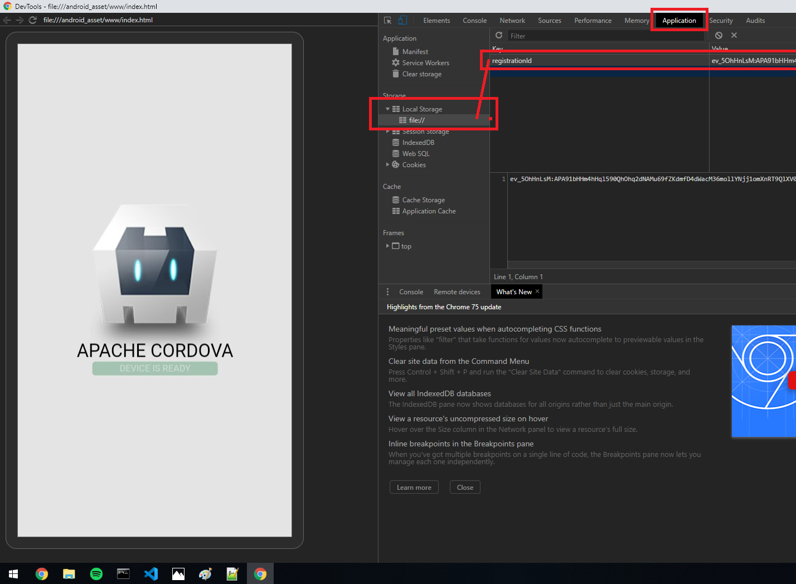
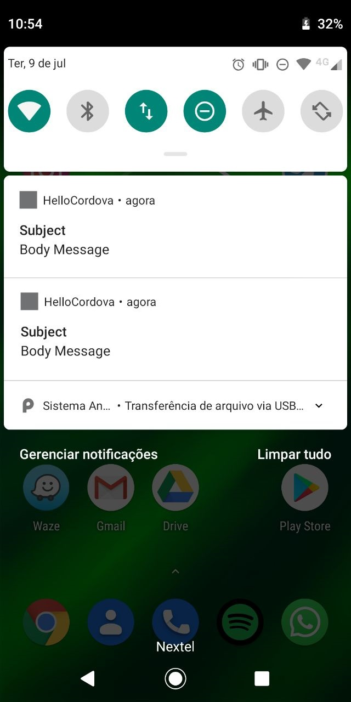

# Cordova PushNotification with phpBackend  

Minha dica seria rodar o [Android Studio](https://developer.android.com/studio), compilar um 'Olá Mundo' no celular.  
Só após isso rodar o cordova:  

```shell
npm install -g cordova  
cordova create MyApp  
cd MyApp  
cordova platform add android  
```


Vamos rodar para verificar se está tudo belezinha:  
```
cordova run android --device  
```  
Ps: `--device` é o Android real xD (Emulador is sux in pc-da-xuxa)   

Add PushNotification:  
```
cordova plugin add phonegap-plugin-push
```


Crie seu projeto no https://console.firebase.google.com/ abra seu projeto e acesse: `Configurações do projeto` 
  


Salve as credenciais: `Chave Do Servidor`->KEY_SERVER e `Código do remetente`->`senderId` :  
      


Dentro do seu `nome_do_projeto/config.xml`   
Copie seu id: `<widget id="io.inwork.pushtest"`  
Ps: Pode alterar o nome do seu pacote: 
* Ele deve ter pelo menos dois segmentos (um ou mais pontos).
* Todo segmento deve começar com uma letra.
* Todos os caracteres devem ser alfanuméricos ou sublinhado [a–z, A–Z, 0–9 e _].  

Mais informações sobre o nome do pacote: https://developer.android.com/studio/build/application-id?hl=pt-BR


No meu caso: `io.inwork.pushtest`

Baixe seu `google-services.json` do Android
https://support.google.com/firebase/answer/7015592?hl=pt-br#android


Salve o arquivo `google-services.json` na pasta: `nome_do_projeto\platforms\android\app\google-services.json`  

Adicione seu `senderId` `PushNotification.init()` no arquivo `nome_do_projeto/www/js/index.js`:
```js
onDeviceReady: function() {
	this.receivedEvent('deviceready');

	console.log('deviceready')

	//Notification	
	var app = this;	
	app.push = PushNotification.init({
		"android": {
			"senderID": "1092837623102"
			//,"icon" : 	'android_icon'
			//,"iconColor": "#ff6600"			 
		},
		"ios": {
		"sound": true,
		"vibration": true,
		"badge": true
		},
		"windows": {}
	});

  	app.push.on('registration', function(data) {
		var oldRegId = localStorage.getItem('registrationId');
		if (oldRegId !== data.registrationId) {
			console.log('new registrationId:', data.registrationId);
			var node = document.createElement("p");
			var textnode = document.createTextNode('registrationId:' + data.registrationId);
			node.appendChild(textnode);
			document.getElementById("deviceready").appendChild(node);

			// Save new registration ID
			localStorage.setItem('registrationId', data.registrationId);
		}
	});


	app.push.on('error', function(e) {
		console.log("push error = " + e.message);
	});
	
	app.push.on('notification', function(data) {		
		app.push.finish(function() {			 
			//Force to show data
			console.log('notification-app-push-success');
		}, function() {
			console.log('notification-app-push-error');
		});
	});
	//End - Notification

},
```


Vamos rodar e verificar se foi gerado um `registrationId` no cordova:  
```shell
cordova run android --device  
```    

Para abrir o remote é necessario fazer esses passos (e já estar com ele em modo dev | Usb de depuração):
  
Mais informações aqui: 


  

No meu caso o `registrationId` foi:
```
ev_5OhHnLsM:APA91bHHm4hHql590QhOhq2dNAMu69fZKdmfD4dWacM36mollYNjj1omXnRT9QlXV0yoVhVVObrvjI95s9_bAk8R9HeL3PfNtw_skJ_3IiIWspM6KxeeTTYJyz3sQN6qa9pqGHFx0TK0
```
Podemos até fechar o aplicativo agora, e focar no php.


deixei um sample no: `cordova_app/api/index.php`

Necessario apenas alterar:
```php
define('KEY_SERVER', '');

// e 
$registerDevice = 'ev_5OhHnLsM:APA91bHHm4hHql590QhOhq2dNAMu69fZKdmfD4dWacM36mollYNjj1omXnRT9QlXV0yoVhVVObrvjI95s9_bAk8R9HeL3PfNtw_skJ_3IiIWspM6KxeeTTYJyz3sQN6qa9pqGHFx0TK0';
```

Chame a url, e veja a magica acontecer:
  


Agradeço muito ao @macdonst por esse tutorial que me ajudou:
http://macdonst.github.io/push-workshop/


